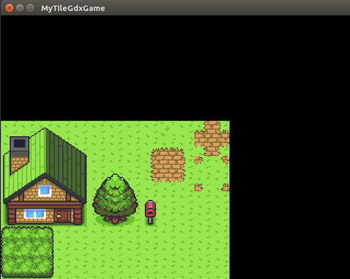

# TileMap-Rendering
Rendering a tiled world from a mapfile and a tileset. 

The tilesheet: 

The mapfile: 
These are the IDs that corresponds to the texture regions on the tileSheet. 
0,1,2,3,4,5,6,7,8,9,10,11,12 
13,14,15,16,17,18,19,20,21,22,23,24,25 
26,27,28,29,30,31,32,33,34,35,36,37,38 
39,40,41,42,43,44,45,46,47,48,49,50,51 
52,53,54,55,56,57,58,59,60,61,62,63,64 
65,66,67,68,69,70,71,72,73,74,75,76,77 
78,79,80,81,82,83,84,85,86,87,88,89,90 
91,92,93,94,95,96,97,98,99,100,101,102,103 
104,105,106,107,108,109,110,111,112,113,114,115,116 

Output: 

Also, I do NOT own the tileSheet image used in this example. All rights belong to it's rightful owner/owner's. No copyright infringement intended. 
